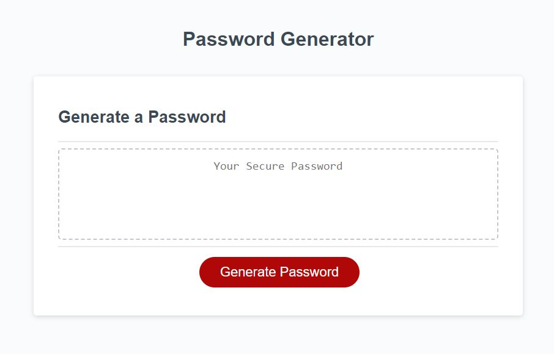
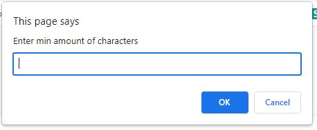
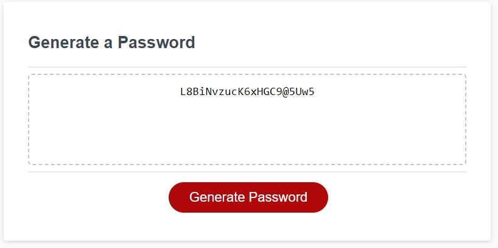

# Random-Password-Generator

## Description

This code creates a randomly generated password based on user inputs. The user inputs include password min and max amount of characters, if lowercase characters should be included, if uppercase characters should be included, if numbers should be included, and if special characters should be included.

## Installation

N/A

## Usage

[link to landing page](https://raw.githack.com/Akleynhans/Random-Password-Generator/main/index.html)

 
Webpage open to landing page with generate password button

 
When the generate password button is pressed prompts pop up in windows for user inputs

 
When all user inputs have been completed a random password is generated and diplayed

## Credits

[link to pick random number between user inputs](https://www.programiz.com/javascript/examples/random-between-numbers#:~:text=In%20JavaScript%2C%20you%20can%20generate,random()%20function.&text=The%20above%20program%20will%20show,as%20input%20from%20the%20user.)
